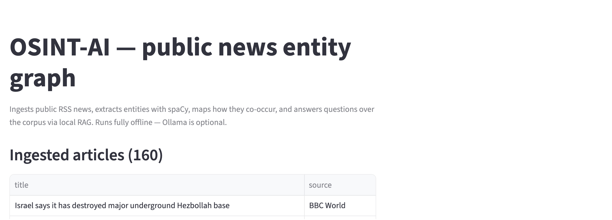
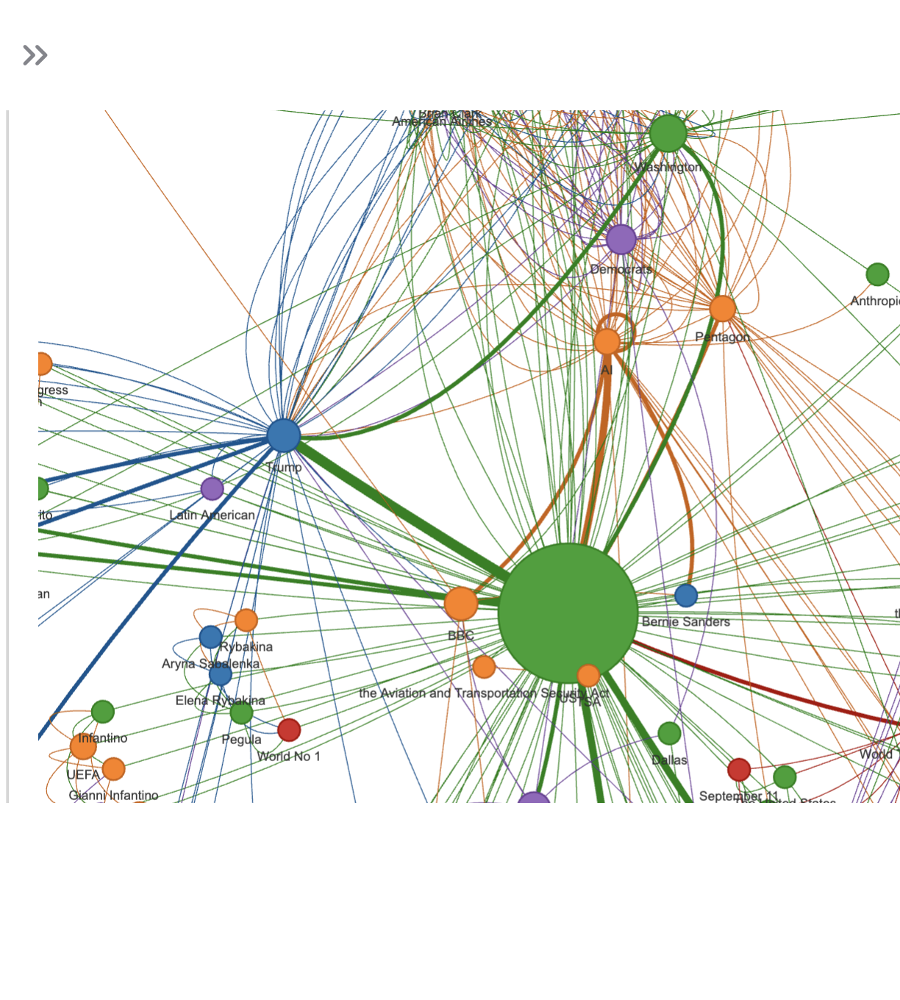
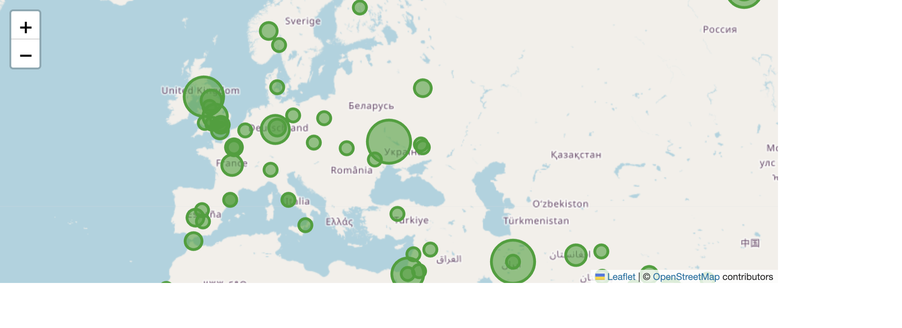
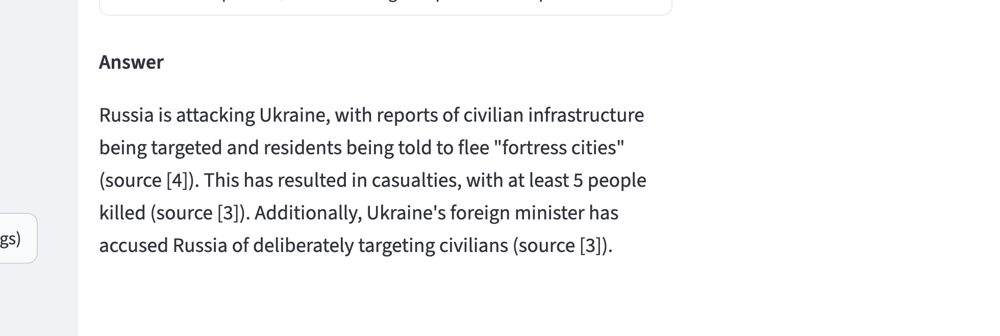

# OSINT-AI

An AI-assisted open-source intelligence tool. It ingests public news feeds, extracts people,
organisations and places with spaCy NER, maps how they co-occur as an interactive graph, and
answers natural-language questions over the corpus with local RAG. Local-first and free: no
cloud, no accounts, no API keys required to run.

## What it looks like

The app pulls public RSS news into local storage and shows what has been ingested, with a
sentiment tone per article.



Entities that appear together in the same article are linked into a co-occurrence graph. In
this run of 160 articles, the United States sits at the centre of the biggest cluster, tying
together political figures, institutions and other countries.



Place entities are geocoded and plotted on a map, sized by how often each place is mentioned.
The clusters over Ukraine, the Middle East and Western Europe reflect the day's news agenda.



Ask a question and the app retrieves the most relevant articles, then (with a local Ollama
model running) generates a grounded answer that cites its sources by number.



## Example analysis

For a worked example of using the tool as an analyst rather than a developer, see
[examples/analysis-2026-09-11.md](examples/analysis-2026-09-11.md). It walks through a single
run end to end: the clusters that emerged, why the United States acts as a bridging hub, the
overall sentiment skew, and an honest section on the method's limitations (entity-resolution
errors, co-occurrence not implying a real relationship, and Western-source bias).

A second, deeper write-up, [examples/analysis-2026-10-03.md](examples/analysis-2026-10-03.md),
goes past the overview and pulls on a single thread (a FlyDubai cockpit-attack story),
corroborating it across three outlets and stopping short of the contested motive to show where
the tool hands off to human verification.

See [PROJECT_SUMMARY.md](PROJECT_SUMMARY.md) for the milestone roadmap.

---

## What's implemented (M1 + M2 + M3)

1. **Ingest**: fetches ~5 public news RSS feeds (BBC, NPR, Al Jazeera, The Guardian, NYT),
   normalises entries, and stores them locally in SQLite.
2. **Extract**: runs spaCy NER over each article's title and summary to pull out people,
   organisations, places and events.
3. **Graph**: builds a co-occurrence graph (entities that appear in the same article are
   linked) and renders it as an interactive HTML graph inside the Streamlit app.
4. **RAG Q&A**: embeds articles locally with `sentence-transformers` into a Chroma vector
   store, retrieves the most relevant ones for a question, and (if a local **Ollama** model is
   running) generates a grounded answer citing the retrieved sources.
5. **Sentiment**: scores each article's title and summary with **VADER**, shown as a compound
   score and a tone label (🟢 positive, 🟡 neutral, 🔴 negative) in the article table.
6. **Geolocation**: geocodes place entities (`GPE`/`LOC`) with **geopy** against the free
   Nominatim service (rate-limited to 1 request/sec, cached locally in SQLite so places are
   never re-queried), and renders them on an interactive **folium** map sized by mention count.

Ingestion, NER and the graph need no LLM at all. RAG retrieval also works without Ollama: it
just shows the matched sources instead of a generated answer (see **Graceful degradation**
below). Geocoding needs internet access to Nominatim, but the rest of the app works without it.

---

## Prerequisites

- Python 3.12 (or 3.10+)
- Internet access to fetch RSS feeds (only public feed URLs, no logins, no scraping)

---

## Setup

```bash
# From the osint-ai/ folder
python -m venv venv
source venv/bin/activate
pip install -r requirements.txt
python -m spacy download en_core_web_sm
```

The first time you index articles, `sentence-transformers` downloads the small
`all-MiniLM-L6-v2` embedding model (~90MB) from Hugging Face and caches it locally. After
that, embedding works fully offline.

## Optional: local LLM for generated answers

RAG retrieval works without any LLM. To also get generated (not just retrieved) answers,
install [Ollama](https://ollama.com) and pull a model:

```bash
brew install ollama
ollama pull llama3.1
ollama serve
```

Leave `ollama serve` running in its own terminal (or use the Ollama menu-bar app). If it is not
running, the app still works: it shows retrieved sources instead of a generated answer.

## Run

```bash
streamlit run app.py
```

Opens at `http://localhost:8501`. In the sidebar:

1. Click **Fetch latest news** to pull the configured RSS feeds into local storage.
2. Click **Extract entities (spaCy NER)** to run NER over the ingested articles.
3. Click **Index articles for search (embeddings)** to embed articles for RAG search.
4. Click **Analyze sentiment (VADER)** to score each article's tone.
5. Click **Geocode places (Nominatim)** to resolve place entities to map coordinates
   (rate-limited to 1 request/sec: geocoding ~150 places takes a couple of minutes the
   first time, then results are cached locally).
6. Scroll down to see the article list (with sentiment), the interactive entity graph, the
   geographic mentions map, and the question box.

All data is stored locally in `data/` (gitignored). Nothing leaves your machine except the
one-time embedding model download, requests to the public Nominatim geocoding service, and,
if used, requests to your own local Ollama server.

---

## Project layout

```
osint-ai/
├── README.md
├── PROJECT_SUMMARY.md
├── requirements.txt
├── .gitignore
├── config.py             # RSS feeds, model names, local paths
├── app.py                # Streamlit UI
├── osint_ai/
│   ├── ingest.py          # RSS to normalised article dicts
│   ├── store.py           # SQLite persistence (articles + entities + sentiment + geocode cache)
│   ├── extract.py         # spaCy NER
│   ├── graph.py           # networkx co-occurrence graph + pyvis rendering
│   ├── enrich.py          # VADER sentiment + geopy/Nominatim geocoding + folium map
│   └── rag.py             # Chroma embeddings, retrieval, optional Ollama answer
├── examples/
│   └── analysis-2026-09-11.md   # worked analyst write-up of a single run
│   └── analysis-2026-10-03.md   # deeper write-up: one thread, cross-source corroboration
├── docs/
│   └── images/            # screenshots used in this README
└── data/                 # local SQLite DB, Chroma store, graph/map HTML (gitignored)
```

---

## Guardrails

- Public data only: RSS feeds meant for syndication, no scraping behind logins.
- Politeness delay between feed requests, and a custom User-Agent identifies the tool.
- Nominatim usage policy respected: max 1 request/sec, identifying User-Agent, results cached
  locally so the same place is never re-queried.
- Fully local: no cloud services, no external APIs beyond the public RSS feeds, the free
  Nominatim geocoder, and your own local Ollama server.
- Graceful degradation: every feature except the generated answer and the map works with no
  LLM or internet, and the map shows a clear message instead of crashing if geocoding is not
  available.

---

Built by Raul de la Hera. Code and analysis are my own work.
GitHub: https://github.com/rauldelahera
Licensed under the MIT License (see [LICENSE](LICENSE)).
